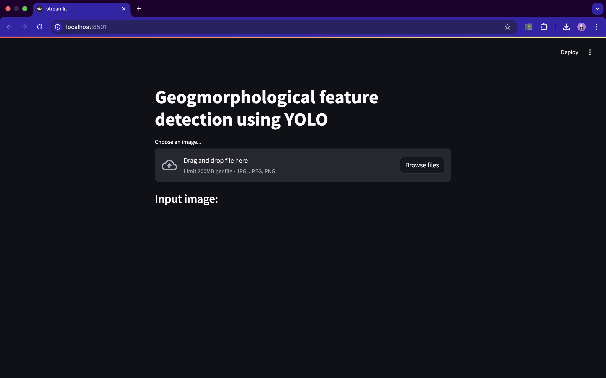
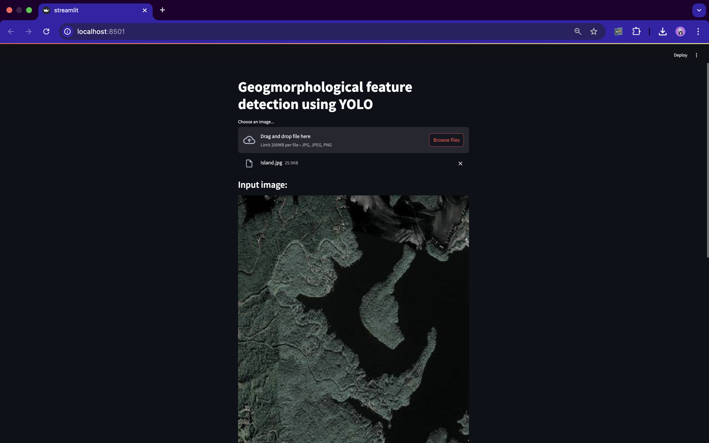
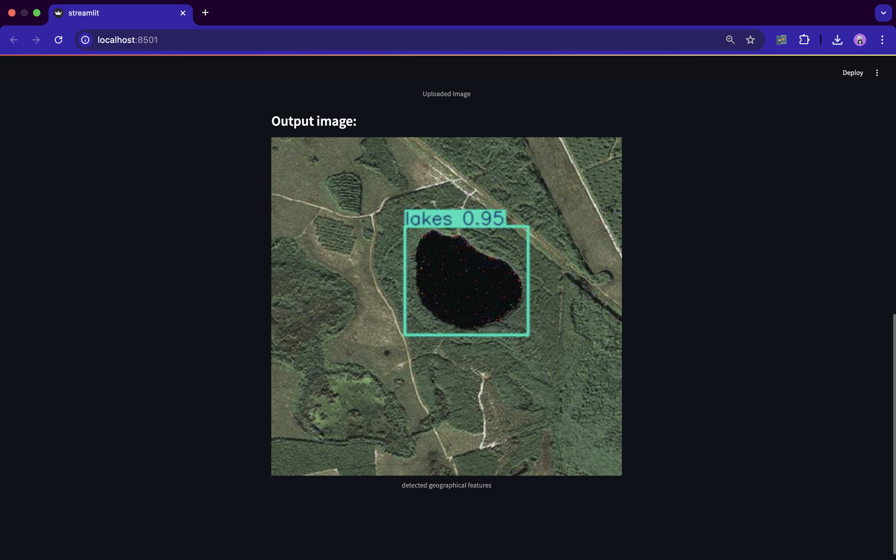
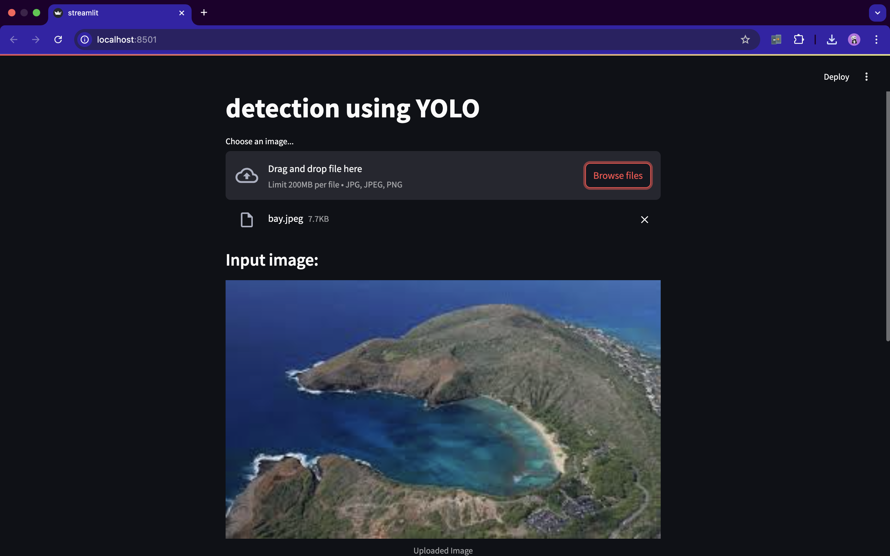
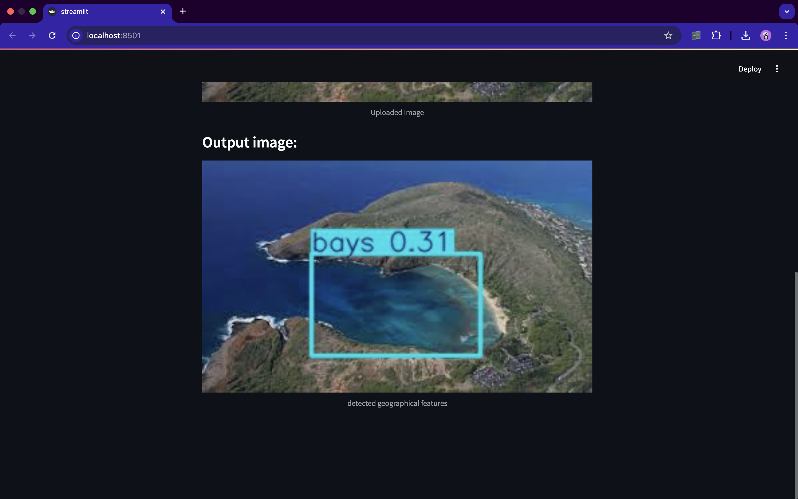
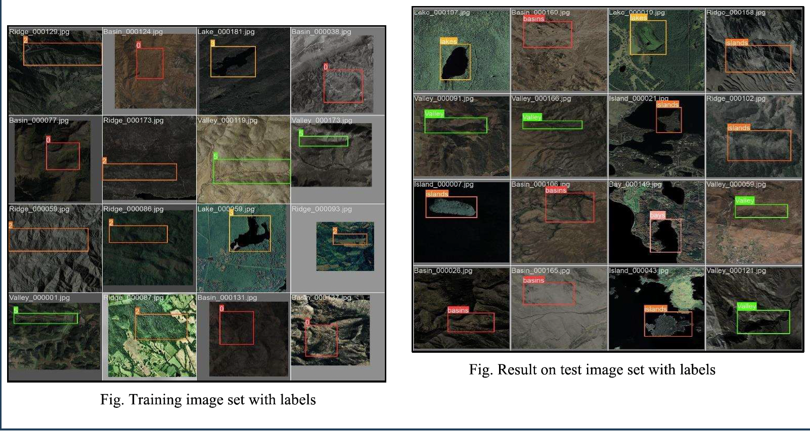

# Geomorphological Features Detection

This project implements a deep learning-based approach to detect geomorphological features such as valleys, basins, ridges, and more from satellite images using the YOLO (You Only Look Once) object detection architecture. It includes data preprocessing, augmentation, training, and a user-friendly Streamlit-based web interface for inference.

---
## Demo Screenshots

- Sample output from the Streamlit app:









---
## Motivation

Accurate detection of geomorphological features is critical for environmental monitoring, disaster risk assessment, and urban planning. This project automates feature detection from satellite imagery, reducing manual effort and enabling large-scale analysis.

---

## Features

- **Preprocessing**: Data cleaning and augmentation using various transformations.
- **YOLOv8 Detection**: Efficient feature detection with a custom-trained YOLOv8 model.
- **Streamlit Interface**: A simple UI for uploading and analyzing satellite images.
- **Image Augmentation**: Enhances training data using techniques such as flipping, grayscale conversion, and noise addition.

---

## Dataset
# GeoImageNet

GeoImageNet a multi-source natural feature benchmark dataset for GeoAI and is suited for the supervised machine learning tasks such as classification and object detection. A distinctive feature of this dataset is the fusion of multi-source data, including both remote sensing imagery and DEM in depicting spatial objects of interest. This multi-source dataset allows a GeoAI model to extract rich spatio-contextual information to gain stronger confidence in high-precision object detection and recognition. The image dataset is tested with a multi-source GeoAI extension against two well-known object detection models, Faster-RCNN and RetinaNet. The results demonstrate the robustness of the dataset in aiding GeoAI models to achieve convergence and the superiority of multi-source data in yielding much higher prediction accuracy than the commonly used single data source.

This dataset contains 876 image pairs from 6 natural feature categories: basins, bays, islands, lakes, ridges, and valleys. The spatial resolution of the images (for both remote sensing imagery and DEM) is at 10 meters. Since the scales of the natural features differ, the image sizes vary from 283 x 213 to 4584 x 4401, with an average size of 635.44 x 593.45. The statistics of feature type and count of this dataset can be found in the following table:

|Category|# of image pairs|
|--|--|
|**Basin**|155|
|**Ridge**|171|
|**Valley**|181|
|**Bay**|93|
|**Island**|106|
|**Lake**|170|
|sum|876|

## Methodology

1. **Data Augmentation**:
   - Script `augmentation.py` applies:
     - Horizontal flips
     - Grayscale transformation
     - Gaussian noise (low and high levels)
   - Augmented images and bounding box information are saved for training purposes&#8203;:contentReference[oaicite:0]{index=0}.

2. **Preprocessing**:
   - The `Preprocess.ipynb` notebook includes resizing, normalization, and annotation parsing for input data.

3. **Model Training**:
   - The YOLOv8 model is trained using `Training.ipynb` on the GeoimageNet dataset, fine-tuning for geomorphological features.

4. **Inference**:
   - Streamlit app (`Streamlit.py`) provides an interface for users to upload images and detect geomorphological features in real time. Detected features are displayed with bounding boxes&#8203;:contentReference[oaicite:1]{index=1}.

---

## Usage

1. **Data Augmentation**:
   - Run `augmentation.py` to generate augmented images and corresponding metadata.

2. **Model Training**:
   - Open `Training.ipynb` to train the YOLOv8 model with the processed dataset.

3. **Inference**:
   - Launch the Streamlit app for detecting features in new images:
     ```bash
     streamlit run Streamlit.py
     ```
   - Upload a satellite image and view the detected geomorphological features.

---


